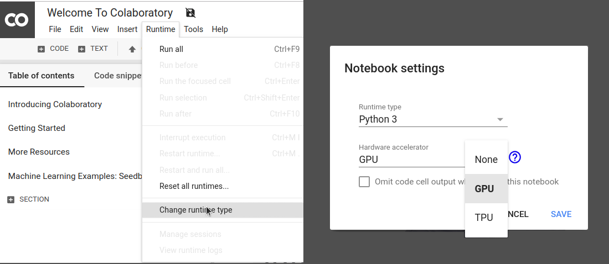

# Escuela de verano de aprendizaje profundo 2019
Este repositorio contiene el material de los cursos de la *Escuela de verano en aprendizaje profundo*, en la cual se abordarán los fundamentos y arquitecturas más importantes de redes neuronales con prácticas de programación. Puedes descargalo comprimido o clonarlo con [Git](https://git-scm.com/).

## Requisitos
La mayoría de las prácticas de los talleres se desarrollarán en Python 3.7+ usando la biblioteca [Tensorflow 2.0](https://www.tensorflow.org/), que adopta [Keras](https://www.tensorflow.org/versions/r2.0/api_docs/python/tf/keras) como interfaz de alto nivel para construir y entrenar redes neuronales.

Cosas para preparar
* Una laptop 
* Este repositorio de GitHub clonado y actualizado antes del taller
* Un sentido aventurero en los datos
* Un ambiente Python 3.7+ con Anaconda (ver opciones 1 y 2 abajo)

Los talleres serán impartidos usando *notebooks* de Jupyter, documentos con código ejecutable, texto, ecuaciones, visualizaciones, imágenes y demás material. Los *notebooks* se pueden crear y ejecutar en la nube via Google Colab (opción 1) o de manera local en tu computadora a través de [Jupyter Notebooks](https://jupyter.org/) (opción 2).

## Opcion 1: Google Colab
[Colab](https://colab.research.google.com) es un servicio de Google para ejecutar *notebooks* en la nube. Provee ambientes de Python 2 y 3 con CPUs, GPUs y TPUs. ¡Y es gratis! Solo necesitas tener una cuenta de Google o crear una.

Recomendamos que elijas un ambiente con Python 3 y GPU. Para activarlo:
* Abre el menú `Entorno de ejecución`
* Elige la opción `Restablecer todos los entornos de ejecución...` . 
* Vuelve a abrir `Entorno de ejecución`
* Elige `Cambiar tipo de entorno de ejecución` 
* Selecciona Python 3 como `Tipo de ejecución` y GPU de la lista de `Acelerador por hardware`

La siguiente captura de pantalla ilustra este proceso. 



En [Colab](https://colab.research.google.com) puedes crear un nuevo *notebook*, subir uno existente desde tu computadora o importarlo de Google Drive o GitHub. 

## Opcion 2: Ambiente local
Para tener la versión de Python 3.7+ y todas las bibliotecas instaladas en cualquier plataforma, recomendamos que uses [**Anaconda**](https://www.anaconda.com/) y generes un ambiente con el archivo `environment.yml` de este repositorio usando una terminal y el comando:

```
conda env create -n escueladl -f environment_cpu.yml
```

Cambia el nombre `escueladl` por tu nombre favorito para el ambiente. Si cuentas con un GPU Nvidia y deseas aprovecharlo cambia el archivo `environment_cpu.yml` a `environment_gpu.yml`.

Para activar el ambiente que creaste, en una terminal ingresa el comando 

```
conda activate escueladl 
```

Una vez activado, puedes ejecutar la aplicación de Jupyter Notebook

```
jupyter notebook
```

Este comando abrirá una pestaña o ventana en tu navegador web, como se muestra en la siguiente captura de pantalla:


Al igual que en Google Colab, puedes crear un nuevo *notebook* seleccionando el botón `New` y posteriormente `Python 3`. De forma alternativa, puedes abrir uno existente seleccionando el archivo del *notebook* (con extensión `.ipynb`) dentro del directorio donde ejecutaste Jupyter Notebook. Con el botón `Upload` agregas archivos que se encuentran en otra parte de tu computadora a este directorio. Para cerrar Jupyter Notebook, presiona el botón `Quit` y posteriormente cierra la pestaña o ventada de tu navegador web. 
 
Para desactivar el ambiente `escueladl` de Anaconda simplemente haz

```
conda deactivate 
```

## Recursos
Si deseas profundizar y continuar practicando, estos son algunos recursos disponibles en Internet.

### Marcos de trabajo
* [Tensorflow](https://www.tensorflow.org/)
* [Pytorch](https://www.pytorch.org/)
* [Caffee 2](https://caffe2.ai/)
* [CNTK](https://cntk.ai/pythondocs/) 
* [Apache MXNet](https://mxnet.apache.org/)

### Conjuntos de datos
* [Datos del gobierno](http://datos.gob.mx">datos.gob.mx)
* [Repositorio de UCI](http://archive.ics.uci.edu/ml)
* [Kaggle](http://www.kaggle.com)

### Libros
* [Deep Learning](http://www.deeplearningbook.org/) de Ian Goodfellow, Aaron Courille y Yoshua Bengio 
* [Neural Networks and Deep Learning](http://neuralnetworksanddeeplearning.com/) de Michael Nielsen 
* [Deep Learning with Python](https://www.manning.com/books/deep-learning-with-python) de Francois Chollet


### Blog *post* y artículos
* [Blog de Chris Olah](https://colah.github.io/)
  * [Understanding LSTM Networks](https://colah.github.io/posts/2015-08-Understanding-LSTMs/)
  * [Neural Networks, Manifolds, and Topology](https://colah.github.io/posts/2014-03-NN-Manifolds-Topology/)
  * [Visual Information Theory](https://colah.github.io/posts/2015-09-Visual-Information/)
  * [Visualizing MNIST](https://colah.github.io/posts/2014-10-Visualizing-MNIST/)
  * [Attention and Augmented Recurrent Neural Networks](https://distill.pub/2016/augmented-rnns/)
* [Blog de Andrej Karpathy](http://karpathy.github.io/)
  * [A Recipe for Training Neural Networks](http://karpathy.github.io/2019/04/25/recipe/)
  * [What a Deep Neural Network thinks about your #selfie](http://karpathy.github.io/2015/10/25/selfie/)
  * [Lessons learned from manually classifying CIFAR-10](http://karpathy.github.io/2011/04/27/manually-classifying-cifar10/)
  * [What I learned from competing against a ConvNet on ImageNet](http://karpathy.github.io/2014/09/02/what-i-learned-from-competing-against-a-convnet-on-imagenet/)
  * [The Unreasonable Effectiveness of Recurrent Neural Networks](http://karpathy.github.io/2015/05/21/rnn-effectiveness/)
  * [Breaking Linear Classifiers on ImageNet](http://karpathy.github.io/2015/03/30/breaking-convnets/)
* [Blog de Sebastian Ruder](http://ruder.io/)
  * [Optimization for Deep Learning Highlights in 2017](http://ruder.io/deep-learning-optimization-2017/)
  * [An overview of gradient descent optimization algorithms](http://ruder.io/optimizing-gradient-descent/)
* [blog de fast.ai](https://www.fast.ai/)
  * [AdamW and Super-convergence is now the fastest way to train neural nets](https://www.fast.ai/2018/07/02/adam-weight-decay/)
* [distill.pub](https://distill.pub/)
  * [The Building Blocks of Interpretability](https://distill.pub/2018/building-blocks/)
  * [GAN Open Problems](https://distill.pub/2019/gan-open-problems/)
 
### Cursos de en línea
* [Practical Deep Learning for Coders, v3](https://course.fast.ai/) de fast.ai
* [Deep Learning Specialization](https://www.coursera.org/specializations/deep-learning) de Andrew Ng

### Congresos
* [International Conference on Representation Learning](http://www.iclr.cc/)                                                                               
* [Neural Information Processing Systems (NIPS)](http://nips.cc/)                                                                                                  
* [International Conference on Machine Learning (ICML)](https://icml.cc/)                                                                  
